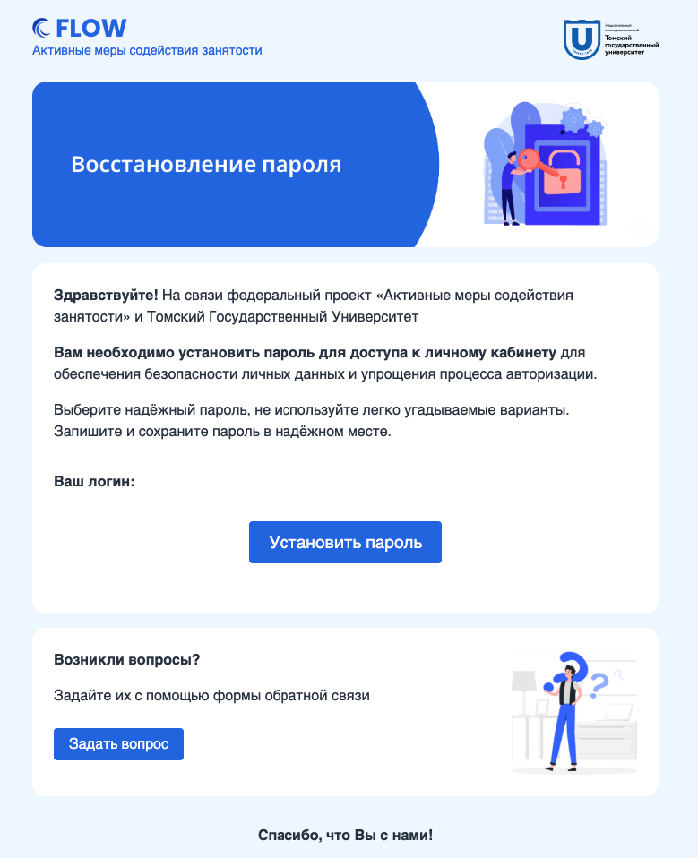
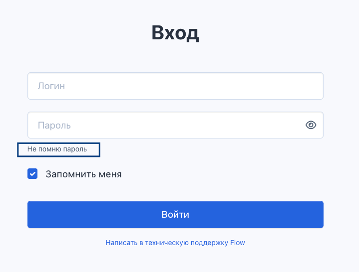

## **Установка пароля при регистрации во Flow 2026**

При первом входе в систему **Flow 2026** вам необходимо самостоятельно установить пароль. Для этого мы подготовили простую инструкцию.

---

### **📩 Шаг 1. Получите письмо от системы**

Сразу после регистрации на ваш email придёт письмо **«Восстановление пароля»**.\
Внутри вы найдёте:

-  логин -- ваш адрес электронной почты;

-  кнопку **«Установить пароль»**.

{width=779px height=958px}

:::quote 

✉️ Если письма нет -- проверьте папку «Спам» или [запросите повторную отправку в поддержке.](https://www.tgu-dpo.ru/form)

:::

---

### **🔧 Шаг 2. Перейдите по кнопке и задайте пароль**

1. Нажмите **«Установить пароль»** в письме.

2. Откроется страница **сброса пароля**.

3. Дважды введите новый пароль -- тот, который будете использовать для входа.

:::quote 

⚠️ **Важно!** Обязательно запомните или сохраните пароль в менеджере паролей.

:::

После этого система покажет сообщение: **«Пароль успешно изменён»** и предложит вернуться на страницу входа.

---

### **🚪 Шаг 3. Войдите в систему с новым паролем**

1. На странице входа укажите ваш **email** (логин из письма).

2. Введите только что установленный пароль.

3. Нажмите **«Войти»**.

---

### **🟡 Шаг 4. Пройдите авторизацию через Яндекс ID**

После входа система направит вас на [**авторизацию через Яндекс ID**](./kak-voiti-s-yandeks.klyuch) – выполните все шаги согласно инструкции на экране.

---

### **🔁 Как изменить пароль в будущем**

Если захотите сменить пароль уже после настройки:

1. Нажмите на **свои ФИО** в **правом верхнем углу** экрана.

2. В выпадающем меню выберите **«Изменить пароль»**.

3. Укажите старый и новый пароль, подтвердите изменение.

---

### **💡 Полезные советы**

-  Используйте **надёжный пароль**.

-  Не сообщайте пароль посторонним.

-  Если забыли пароль -- воспользуйтесь функцией «Не помню пароль» на странице входа.

{width=719px height=546px}

✉️ **Возникли проблемы?** Напишите в [поддержку Flow](https://www.tgu-dpo.ru/form).