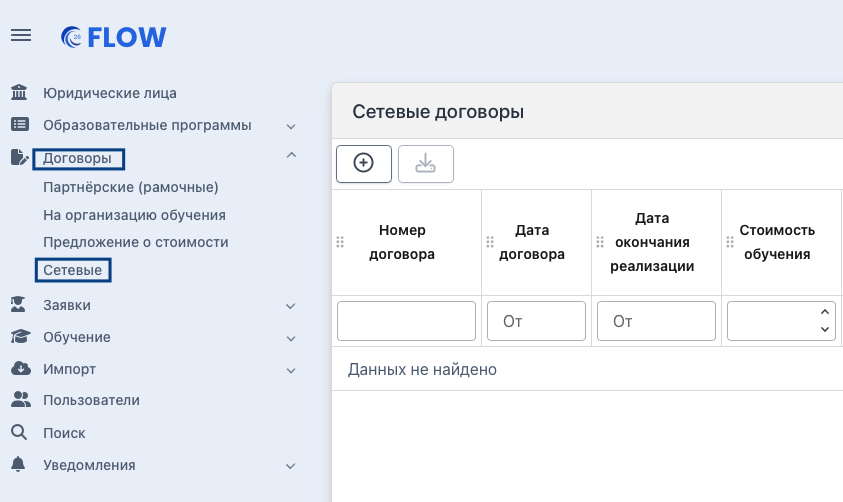
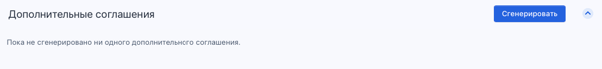
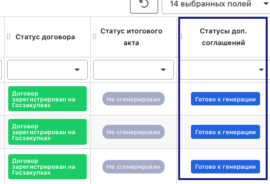
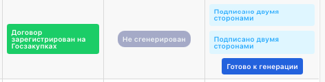

Реализована генерация доп.соглашений для сетевых договоров на организацию обучения.

{width=843px height=502px}

Для этого:

1\.На странице сетевого договора есть блок “**Дополнительные соглашения”** (как на странице договора на организацию обучения).

2\.В этом блоке есть кнопка “Сгенерировать”.

{width=1108px height=128px}

3\.При клике на кнопку “Сгенерировать” откроется страница “**Сгенерировать дополнительное соглашение к сетевому договору ”** с наполнением:\
\- поле для свободного ввода текста “Основной текст” - обязательное поле,\
\- переключатель “Изменить дату окончания реализации договора” и поле с выбором “Дата”.\
Если переключатель включен, поле с выбором даты обязательное, если не включен - необязательное.\
\- кнопка “Сгенерировать”.

4\.Процесс подписания доп.соглашений не отличается от процесса подписания сетевого договора.

5\.Нумерация в доп.соглашениях будет по порядку 1, 2, 3, 4

Еще в системе реализованы статусы дополнительных соглашений:

На странице со списком сетевых договоров есть столбец “Статусы доп. соглашений”.

{width=461px height=314px}

Если у договора несколько дополнительных соглашений, будут отображаться статусы всех. По столбцу работают фильтр и сортировка

{width=472px height=120px}

Список возможных статусов:\
\- сгенерировано (сгенерировано, но не загружена ни одна подпись),\
\- подписано федеральным оператором (загружена одна подпись ФО),\
\- необходимо ввести дату соглашения (загружено две подписи ФО и ОП, но еще нет даты ДС),\
\- подписано двумя сторонами (есть две подписи ФО и ОП и есть дата ДС).

