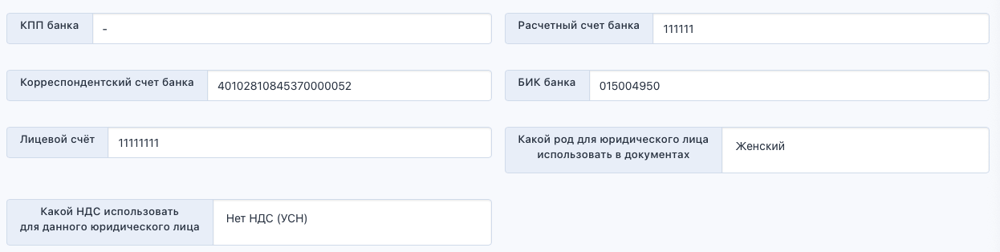
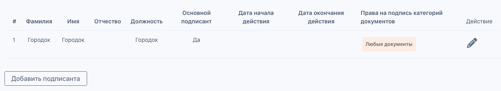

:::info 

Юридические данные образовательного партнёра необходимо заносить в Справочники для дальнейшего использования при составлении договора.

:::

На странице создания/редактирования юридического лица

[tabs]

[tab:Информация]

В этом блоке будет отображаться информация об:

-  **ИНН** должен содержать 10 или 12 цифр

-  **КПП** должен содержать 9 цифр

-  **ОГРН**

-  **Наименование** образовательного партнёра

-  **Образовательные партнёры** - выбрать университет, заведенный в Odin для образовательного партнёра

-  Указать род ЮЛ для использования в документах

-  Указать информацию о выпуске приказов (автоматически/вручную) (включение автоматического выпуска доступно только администраторам)

-  Указать, разрешен ли бумажный документооборот

-  Как гражданин должен доставить оригиналы документов (лично/почтой) (указывает образовательный партнёр)

[/tab]

[tab:Лицензия]

В данном блоке необходимо заполнить:

**Номер лицензии**

**Наименование организации, выдавшей лицензию**

**В творительном падеже**

**Дата выдачи лицензии**

[/tab]

[tab:Банковские реквизиты]

Здесь указываются следующие данные:

**Наименование банка**

**ИНН банка**

**КПП банка**

**Расчетный счет банка**

**Корреспондентский счет банка**

**БИК банка**

**Вид НДС**

**Лицевой счёт**

{width=1246px height=314px}

[/tab]

[tab:Контакты]

В контактах указываются:

**Электронная почта**

**Электронная почта ответственного за программу**

**Имя ответственного за программу**

**Отчество ответственного за программу**

**Фамилия ответственного за программу**

**Телефон**

**Контактный Email для публикации на РР**

**Контактный телефон для публикации на РР**

**Юридический адрес**

**Почтовый адрес**

**Город регистрации**

[/tab]

[tab:Данные подписантов]

В блоке заполняется и отображается следующая информация:

**Фамилия**

**Имя**

**Отчество**

**Должность**

**Основной подписант**

**Права на подпись категорий документов**

{width=1236px height=226px}

[/tab]

[/tabs]

