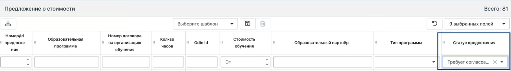

Образовательный партнер генерирует предложение о стоимости.

## Условия для появления возможности генерации Предложения о стоимости

-  Наличие подписанного с обеих сторон [Договора на организацию обучения](./README-2/_index)

-  Регистрация договора на Госзакупках. Договор регистрирует представитель Федерального оператора, затем делает пометку о регистрации в договоре.

-  Указание даты для второй подписи

**Генерация предложения о стоимости проходит со стороны Образовательного партнёра.** [**Подробнее**](https://gramax.smile-tech.study/Flow_TSU_OP_help/spravochniki/predlozhenie-o-stoimosti-dlya-programmy)

Далее представитель федерального оператора заходит в  Справочники - Предложения о стоимости, сортирует таблицу по столбцу **Статус предложения** «**Требует согласования**"**.**

{width=1302px height=181px}

В блоке "**Предложения о стоимости**" необходимо проверить и отклонить/подтвердить предложение:

-  в случае отклонения необходимо написать комментарий с указанием причины (причина будет видна Образовательному партнёру, Предложение перейдет в статус - "**Отклонено**");

-  после нажатия на кнопку Подтвердить, появится форма для дополнительного подтверждения.  Предложение перейдёт в статус "**Согласовано**".

## Статусы предложений о стоимости

-  **Сгенерировано** (статус отображается, если ОП сгенерировал предложение, но еще не загрузил подпись).

-  **Подписано образовательным партнёром** (статус отображается, если ОП загрузил sig файл с подписью).

-  **Согласовано** (статус отображается, если ФО одобрил предложение).

-  **Отклонено** (статус отображается, если ФО отклонил предложение).